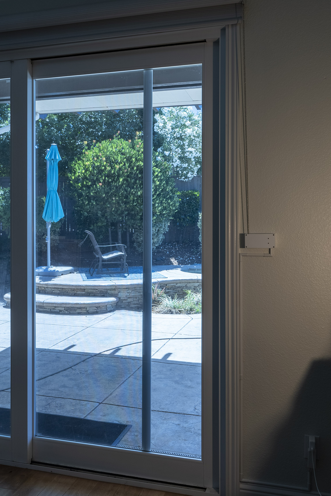

# AutoBlinds

This repository contains various project files necessary to build a smart home connected device that moves a roller shade up and down by its bead string. The automation part is based on an ESP8266 microcontroller that talks to an automation hub via Wi-Fi and MQTT and is fully compatible with Home Assistant. The mechanical part is based on a NEMA 17 stepper motor with a TMC2208 driver, and the case and gears are 3D printed. Using a 48mm 2A stepper motor is sufficient to move a heavy 2.6 x 2.4 meter roller blind up or down in 20 seconds.


## Origin

The project is inspired by another similar project, [ESPBlinds by se1exin](https://github.com/se1exin/ESPBlinds). The only parts reused from that project are the small gear and chain gears, everything else is rebuilt from scratch.

The main improvements are:

- Local control with up and down buttons
- Shade movement limits programmable from the buttons
- Soft start and stop
- Revised MQTT interface that is easily compatible with Home Assistant and supports moving the shade to a specific position
- Much smaller device by using a smaller big gear and packing things tighter in the case
- Quieter operation with the TMC2208 silent stepper driver

## Software

The software for the ESP8266 module is included here, see the [`autoblinds.ino`](autoblinds.ino) file. It builds with Arduino IDE version 1.8.19.

Additional steps before building:

- Install the ESP8266 boards for Arduino, see [this manual](https://arduino-esp8266.readthedocs.io/en/latest/installing.html)
- Install the PubSubClient library through the Arduino Library Manager.
- Copy the [`constants.example.h`](constants.example.h) file into `constants.h` and adjust the settings to match your network setup.

Build the project and program the board, it *should* work and report a connection to WiFi and MQTT through the serial port.

## Device Overview


## Button Operation

- Press the Up button to open the shade up to the top limit.
- Press the Down button to close the shade down to the bottom limit.
- While the shade is moving, press any button to stop it.
- Hold the Up button and press the Down button to set the top limit.
- Hold the Down button and press the Up button to set the bottom limit.
- Hold the Up or Down button for more than 0.5 seconds to open or close the shade beyond the limits (useful for setting the limits).

Note that while the limits are not set, the shade will not stop automatically. After assembling the device and uploading the program, make sure to set the limits first.

## Schematic Diagram


## Parts

You'll need the following parts:

- 3D printed case and gears, including 2x ChainGear model. Use PETG filament for best results, not PLA. The models are available in the [models](models) folder in STL and as a Fusion 360 project.
- [ESP8266 board](https://www.amazon.com/dp/B081PX9YFV)
- [DC-DC converter](https://www.amazon.com/dp/B01MQGMOKI) capable of turning your input voltage into 3.3V for the ESP
- [TMC2208 stepper driver](https://www.amazon.com/dp/B08XV1HKYF)
- [NEMA 17 stepper motor](https://www.amazon.com/dp/B00PNEQKC0)
- 12-24V 2A+ power supply
- [4x6cm prototype PCB](https://www.amazon.com/dp/B07NM68FXK) and some header connectors
- [Push button switches](https://www.amazon.com/dp/B01MRP025V) - 2pc 6x6x8 mm
- Screws with hex caps: 12pc M3x8, 4pc M3x16, 4pc M2x6 - I used [this set](https://www.amazon.com/dp/B08JCKH31Q)
- Screws or anchors to mount the device to the wall - the selection depends on the wall material.
- Generic capacitors, wires, etc.
- Some grease and a Dremel with small drill bits

## Finished PCB


## Assembly steps

- Print the mechanical parts. None of them need any supports. The axle should be printed vertically with a brim, using as many perimeters as necessary to fill the entire volume.
- Drill the screw holes in the lid for the 4 M3 screws to pass freely.
- Put the small gear onto the motor axle. The fit should be very snug.
- Attach the motor to the case with 4 M3x8 screws. The two screws in the back can be accessed by putting an Allen key through the special holes on the left of the case.
- Connect the chain gears with the big gear using 4 M3x16 screws. The screws won't go easily through the holes in the chain gears, so just drill the holes a bit wider. I didn't design those chain gears so can't easily fix the models.
- Attach the PCB to the lid using 4 M2x6 screws.
- Put the big gear assembly onto the axle, add the washers - the wide one on the left, the narrow one on the right. The wide washer will need a little bit of Dremeling to fit between the screw heads.
- Make sure that the gear assembly and the axle fit into the case and things rotate freely. There might be some more Dremeling necessary to make things fit with little friction.
- Put the bead string through the chain gears.
- Insert the gear assembly into the case, secure the axle with the two clamps and tighten them with 4 M3x8 screws.
- Hold the device against the wall to figure out the right position to tension the string.
- Mount the device to the wall. Note that the mounting holes have vertical slots to adjust the tension. *In case you're wondering why the mounting holes are at the bottom, that's because when the device starts pulling on the string, this way it will just push the top side into the wall.*
- Connect the motor to the PCB, power it up and test.
- Adjust the current limiter on the stepper driver to make sure the current is enough to raise the shade without stalling. You may also want to adjust the speed parameters in the program, look for `MOTOR_MIN_SPEED`, `MOTOR_MAX_SPEED` and `MOTOR_ACCELERATION` in [`autoblinds.ino`](autoblinds.ino). Note that those steps are actually microsteps, and the default microstep for TMC2208 is 1/8 step when both MS1 and MS2 pins are low.
- Apply some grease on the gears and axle. This will likely require removing the gear assembly from the case, but doing it earlier would just be messy.
- Close the lid with 4 M3x8 screws. The lid may stick out in the middle; if that's the case, just put it on the 3D printer heatbed, heat that to the print temperature, and bend the lid a few degrees inwards. After cooling down, the lid will act like a spring.

## More Pictures




## Home Assistant Integration

Home Assistant supports [MQTT shades](https://www.home-assistant.io/integrations/cover.mqtt) ("covers") natively, so you'll need to add something like this to `configuration.yaml`:

```yaml
mqtt:
  cover:
  - name: "Friendly Name"
    availability:
      # Note that the topic root used here 5 times (home/blinds/)
      # must match MQTT_TOPIC_ROOT defined in constants.h
      - topic: "home/blinds/status"
    command_topic: "home/blinds/command"
    payload_open: "open"
    payload_close: "close"
    payload_stop: "stop"
    position_topic: "home/blinds/position"
    set_position_topic: "home/blinds/setposition"
    state_topic: "home/blinds/state"
```

Obviously, you'll also need an [MQTT broker](https://mosquitto.org), but that's very easy to set up.

## What Could Be Improved

- Limit switches would solve the issue of position drift: when the motor disengages, the gears move a bit releasing the string tension. That movement is not registered by the controller. Also, if someone moves the shade manually, the limits currently need to be reset because manual motion is also not registered by the MCU.
- There's no user-friendly way of setting up the Wi-Fi and MQTT parameters. Other devices host an access point that is used for such initial setup.
- The orientation of the driver module makes the radiator fins horizontal, while vertical orientation is better. Originally I - The orientation of the ESP module on my PCB prevents attaching a USB cable without removing the board from the device.
used the DRV8825 driver, and its radiator could be attached the other way.
- No barrel connector for power, although it's not much of a problem as the cable just goes through one of the vent slots and into the cord cover.
- Tiny round buttons sticking out don't look so well, and it's possible to make button caps with e.g. triangular shape pointing up and down. The buttons should probably be shorter in that case, and the lid holes should match the button shape.
- Using a real custom PCB would just look better.

## Feedback

If you have any suggestions or comments, feel free to post issues or pull requests here on GitHub. Constructive criticism is welcome, especially considering that I'm relatively new to this type of engineering.

## License

This project is distributed under the terms of the [MIT License](LICENSE.txt).